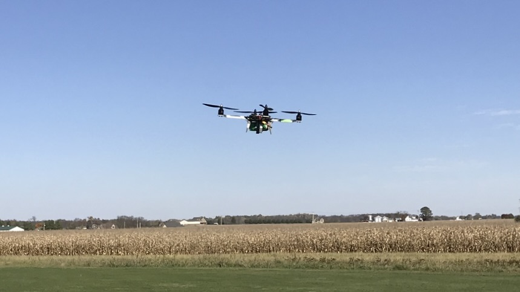

# Projects

Here you will find a collection of personal projects I’m particularly proud of. Many of these projects were completed in my personal electronics lab, an independent, self-funded space for prototyping, experimentation, and fabrication. Where applicable, the associated design and source files are generally provided under permissive open-source licenses. 

* [7-Segment LCD Driver Board](https://github.com/SomeInterestingUserName/lcd-7seg), a custom PCB for a 7-segment display built around the PCF8562 driver IC

* [MIDI SwitchBox](https://SomeInterestingUserName.github.io/SwitchBox), an open-source instrument-controlled MIDI channel multiplexer that started out as a tool to help me quickly switch keyboard patches in marching band

* [ezplot](https://github.com/SomeInterestingUserName/ezplot), a command line utility for quickly plotting data straight from `stdout`

I've also worked on a few other projects that have yet to be published and/or open-sourced. Here's a preview of what's to come:

* A modular remote-controlled airplane

* A quadcopter with a frame built almost entirely from 3D-printed parts

* A "smart battery cable" for remotely monitoring the battery status of remote-controlled vehicles

* A test stand for characterizing propellers and motors

* An angular rate-sensing gyroscope built from a model airplane motor
