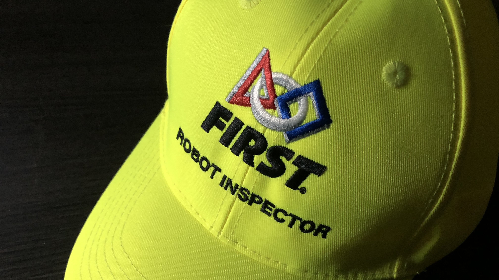

# Service

## Volunteering
* FIRST Alumni and Mentors Network At Michigan (FAMNM) Volunteer Coordinator (2021-present)
* Robotics Graduate Student Council Outreach Co-Chair (2022)
* Robotics Outreach Ambassador (2022)
* *IEEE Transactions on Robotics (T-RO)* 2022 Reviewer
* *Principles of Programming Languages (POPL)* 2021 Student Volunteer
* Indiana University Science Fest (2019)
* Indiana University Bicentennial Traveling Exhibit (2019)
* White River Library Programming Class (Summers 2016 and 2017)
* Center Grove High School Marching Band Volunteer Software Developer	(2016-2017, 2019)
* Indiana University Journal of Undergraduate Research Web Development 	(2016-2017)
 
---

## Mentoring

My mentors got me to where I am today, and I want to pay it forward to the next generation of researchers. As of today, I have mentored ten undergraduate research assistants. Of these ten students, three were visiting students from the Addis Ababa Institute of Technology in Ethiopia, participating in our university’s African Undergraduate Research Adventure (AURA) program. My mentees come from a diverse range of fields, including aerospace engineering, computer science, and mathematics. I find mentorship to be highly rewarding, with a significant payoff over the long term.

I have observed that, with the proper guidance and encouragement, mentees tend to themselves become personally invested in the project and its success. It isn’t a quick process, however. It takes plenty of patience and empathy, especially in competitive programs where undergrads take on a grueling regimen of courses and extracurriculars, in addition to their research commitments. As I myself was an undergrad not too long ago, I frequently try to imagine myself in their position when giving advice or helping them with a tough problem. The long-term investment strategy appears to have paid off---the majority of my mentees ask to continue on the project after their first semester, and two are just beginning their third year with us. 

One of my first experiences in mentorship came as a service learning opportunity during my third year at Indiana University, where we volunteered with the Burmese-American Community Institute (BACI). Indiana is home to one of the country’s largest Burmese-American communities, of which many are refugees. We were tasked with mentoring high school students applying to college, by offering guidance on degree programs, revising their application materials, and even just offering them a glimpse into our college experiences. My mentees in particular were interested in undergraduate research, so I tapped into my own experiences finding such opportunities to give them tailored advice on finding their own. 

Over the years, mentorship has provided me ample opportunity for self-improvement; guiding others through a concept or process allows me to introspect on and reinforce my own understanding. I am always learning alongside my mentees.
